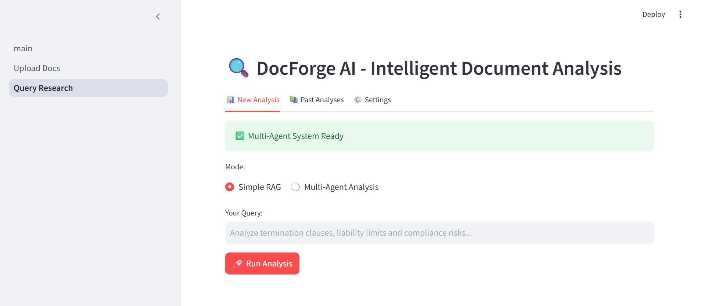
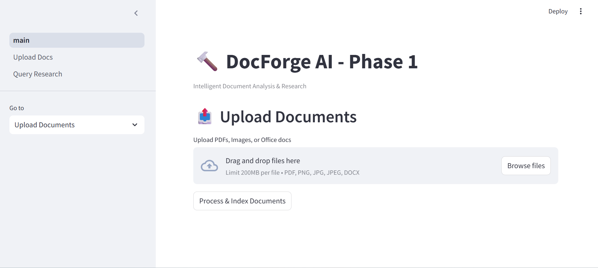
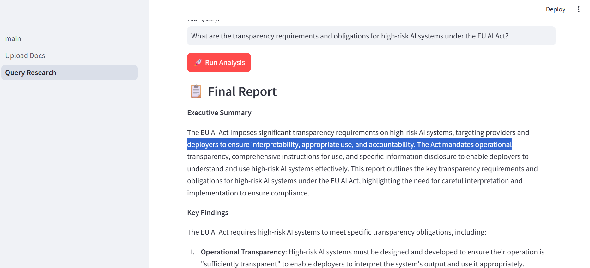

# DocForge AI

**Intelligent Multi-Agent Document Analysis & Research Platform**

An advanced AI system designed for contract review, compliance analysis, and legal research. Combines powerful document parsing, hierarchical RAG, web research, and a team of specialized AI agents.

---

## ✨ Key Features

- **Multi-Modal Ingestion**: PDFs, scanned documents, images with robust OCR (Docling + PyMuPDF)
- **Hierarchical Chunking**: Parent-Child chunking optimized for long legal documents
- **Hybrid Retrieval**: Dense (semantic) + Sparse (BM25) using Pinecone
- **Multi-Agent Architecture**: Planner, Researcher, Analyzer, Report agents
- **Reranking**: Voyage AI + Cross Encoder fallback
- **Semantic Long-term Memory**: Remembers and reuses past analyses
- **Web Research**: Real-time supplementary research with ethical scraping
- **Professional Reports**: Executive summaries with risk assessment and citations
- **Observability**: Full tracing with LangSmith
- **Production Ready**: Retry logic, Circuit Breaker, robust error handling

---

## 🛠 Tech Stack

- **Backend**: Python + LangGraph + LangChain
- **Vector Database**: Pinecone (Hybrid Search)
- **Embeddings**: BAAI/bge-small-en-v1.5
- **LLMs**: Groq (Llama-3.3-70B), Gemini, Ollama (local fallback)
- **Document Parsing**: Docling + PyMuPDF
- **Frontend**: Streamlit
- **Backend**: FastApi
- **Monitoring**: LangSmith

---

## 🚀 Quick Start

### 1. Clone the repository
```bash
git clone https://github.com/yourusername/docforge-ai.git
cd docforge-ai 
```

### 2. Install dependencies
Bash
pip install -r requirements.txt

### 3. Environment Variables (.env)
envGROQ_API_KEY=your_groq_key
PINECONE_API_KEY=your_pinecone_key
TAVILY_API_KEY=your_tavily_key
VOYAGE_API_KEY=your_voyage_key          # Used for reranking
LANGCHAIN_API_KEY=your_langsmith_key
LANGCHAIN_TRACING_V2=true
LANGCHAIN_PROJECT=docforge-ai
### 4. Run the app
```bash streamlit run app/main.py
```

## 📁 Project Structure
```
docforge-ai/
├── app/
│   ├── main.py
│   └── pages/
│       ├── 1_Upload_Docs.py
│       └── 2_Query_Research.py
├── core/
│   ├── rag_indexer.py          # Hierarchical Chunking + Pinecone
│   ├── memory_manager.py       # Semantic Long-term Memory
│   ├── graph.py                # Agent Graph
│   ├── graph_utils.py          # Reranking, Circuit Breaker, PDF, Retry
│   ├── agents.py
│   ├── evaluator.py
│   └── ...
└── README.md
```
## 🔧 Core Capabilities

Smart Reranking: Uses Voyage AI as primary reranker with local Cross Encoder fallback for reliability
Production Resilience: Retry logic (Tenacity), Circuit Breaker pattern, graceful degradation
Observability: Full tracing and evaluation with LangSmith.
Legal Optimization: Hierarchical chunking + strong risk & citation focus

## screenshot 
 ,
 
 


## 📈 Roadmap

 Multi-agent system,
 Pinecone Hybrid + Hierarchical Chunking,
 Semantic Long-term Memory,
 LangSmith Observability,
 PDF report enhancements,
 Advanced reranking (Voyage + Cross Encoder),
 LangSmith monitoring + evaluation,
 GraphRAG (entity relationships),
 User authentication & multi-user support


## 🤝 Contributing
Pull requests are welcome! Feel free to open issues for bugs or feature requests.

Built for legal professionals, compliance teams, and AI researchers.

## MIT License

Copyright (c) 2026 Orimoloye (DocForge AI)

Permission is hereby granted, free of charge, to any person obtaining a copy
of this software and associated documentation files (the "Software"), to deal
in the Software without restriction, including without limitation the rights
to use, copy, modify, merge, publish, distribute, sublicense, and/or sell
copies of the Software, and to permit persons to whom the Software is
furnished to do so, subject to the following conditions:

The above copyright notice and this permission notice shall be included in all
copies or substantial portions of the Software.

THE SOFTWARE IS PROVIDED "AS IS", WITHOUT WARRANTY OF ANY KIND, EXPRESS OR
IMPLIED, INCLUDING BUT NOT LIMITED TO THE WARRANTIES OF MERCHANTABILITY,
FITNESS FOR A PARTICULAR PURPOSE AND NONINFRINGEMENT. IN NO EVENT SHALL THE
AUTHORS OR COPYRIGHT HOLDERS BE LIABLE FOR ANY CLAIM, DAMAGES OR OTHER
LIABILITY, WHETHER IN AN ACTION OF CONTRACT, TORT OR OTHERWISE, ARISING FROM,
OUT OF OR IN CONNECTION WITH THE SOFTWARE OR THE USE OR OTHER DEALINGS IN THE
SOFTWARE.
